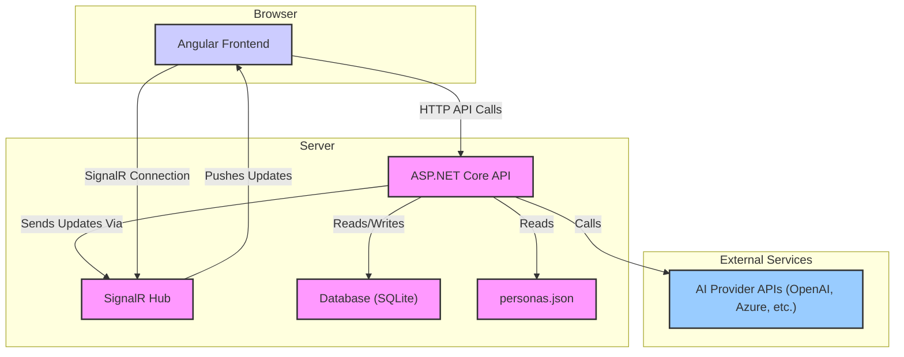
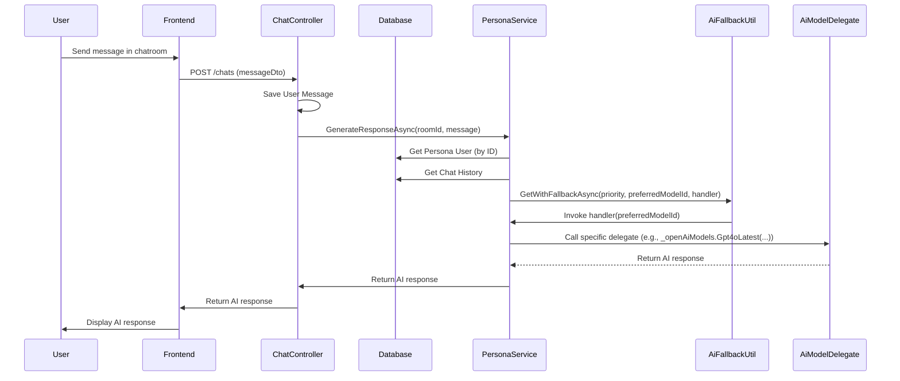
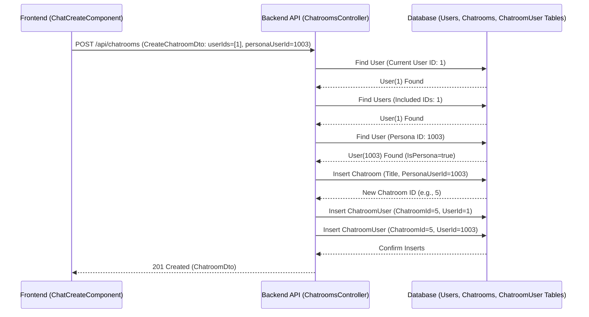
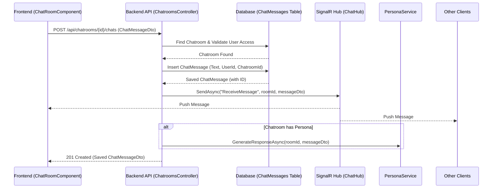
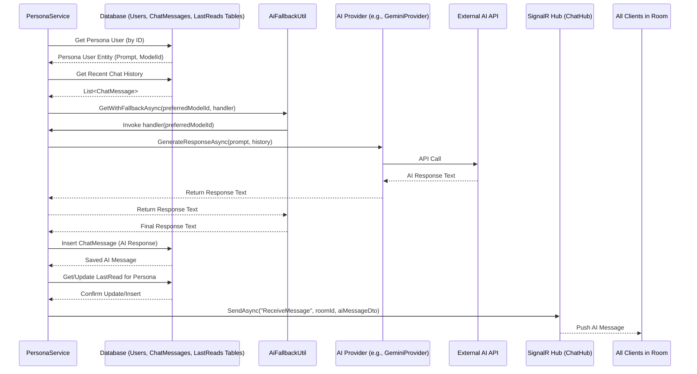

# ChattyMcChatface - AI-Powered Chat Application

Welcome to ChattyMcChatface, a modern real-time chat application featuring AI-powered personas! This
application allows users to chat with each other and interact with different AI personalities.

## Features

-   **Real-time Chat:** Engage in instant messaging with other users using SignalR.
-   **AI Persona Integration:** Chat with AI personas powered by various large language models
    (LLMs). Each persona has a distinct personality defined by a system prompt.
-   **Flexible AI Backend:** Supports multiple AI providers (OpenAI, Azure OpenAI, Gemini, Claude
    via Anthropic/Vertex) with fallback capabilities.
-   **User Authentication:** Secure registration and login.
-   **Modern Tech Stack:** Built with a .NET 9 backend and an Angular frontend.

## Technology Stack

-   **Backend:** .NET 9, ASP.NET Core Web API, SignalR
-   **Frontend:** Angular, TypeScript, RxJS
-   **Database:** Entity Framework Core with SQLite (for development)
-   **AI Integration:** Configurable providers for various LLMs.

## Architecture Overview

The application uses a client-server architecture:

-   **Frontend (Angular):** Single Page Application (SPA) that handles user interaction, displays
    messages, connects to the SignalR hub for real-time updates, and communicates with the backend
    API for data and actions.
-   **Backend API (.NET 9):** Provides RESTful endpoints for user management, chatroom operations,
    and message handling. It orchestrates AI interactions, manages database operations via EF Core,
    and pushes real-time updates via the SignalR Hub.
-   **SignalR Hub:** Facilitates real-time bidirectional communication between the server and
    connected clients.
-   **Database (SQLite):** Stores user accounts, chatroom details, message history, and persona
    associations.
-   **AI Services:** External LLM APIs are called by the backend to generate responses for AI
    personas.



## Project Structure

-   **`angular-client/`**: Contains the Angular frontend application.
    -   `src/app/`: Core application modules, components, and services.
    -   `src/environments/`: Environment-specific configurations (API URLs).
-   **`dotnet_server/`**: Contains the .NET 9 backend API.
    -   `ChattyMcChatface.Api/`: The main ASP.NET Core project (controllers, `Program.cs`, SignalR
        Hub).
    -   `ChattyMcChatface.Core/`: Business logic, services (including `PersonaService` and AI
        providers), DTOs.
    -   `ChattyMcChatface.Data/`: Contains Entity Framework Core context, entity definitions, and
        migration code files.
    -   **Note:** The active SQLite database file (`chatty.db`) used during development runtime and
        migrations resides in the `ChattyMcChatface.Api/` directory.
    -   `ChattyMcChatface.Tests.Unit/`: Unit tests.
    -   `ChattyMcChatface.Tests.Integration/`: Integration tests.
    -   `ChattyMcChatface.Tests.ServiceIntegration/`: Service-level integration tests, including
        live AI provider validation.

## Getting Started

**Prerequisites:**

-   [.NET 9 SDK](https://dotnet.microsoft.com/download/dotnet/9.0)
-   [Node.js](https://nodejs.org/) (v18+ recommended) and npm
-   [Git](https://git-scm.com/)

**Setup & Running:**

1.  **Clone the repository:**

    ```bash
    git clone <repository_url>
    cd chatty-mcchatface
    ```

2.  **Install Frontend Dependencies:**

    ```bash
    cd angular-client
    npm install
    cd ..
    ```

3.  **Configure Backend Secrets:** The backend requires API keys for the AI providers. Use the .NET
    Secret Manager:

    ```bash
    cd dotnet_server/ChattyMcChatface.Api
    dotnet user-secrets init # Only needed once per project

    # Example: Set OpenAI Key
    dotnet user-secrets set "OpenAI:ApiKey" "YOUR_OPENAI_API_KEY"

    # Example: Set Azure OpenAI Keys (using 'Thrivify' deployment name from config)
    dotnet user-secrets set "AzureOpenAI:Thrivify:ApiKey" "YOUR_AZURE_API_KEY"
    dotnet user-secrets set "AzureOpenAI:Thrivify:Endpoint" "YOUR_AZURE_ENDPOINT"

    # Example: Set Anthropic Key
    dotnet user-secrets set "Anthropic:ApiKey" "YOUR_ANTHROPIC_API_KEY"

    # Example: Set Gemini Key
    dotnet user-secrets set "Gemini:ApiKey" "YOUR_GEMINI_API_KEY"

    # Example: Set Vertex AI Key (Requires JSON content and Location)
    dotnet user-secrets set "VertexAI:Location" "YOUR_VERTEX_LOCATION" # e.g., us-central1
    # Use single quotes if your shell needs it for the JSON string
    dotnet user-secrets set 'VertexAI:KeyJsonContent' '{"type": "service_account", ...}'

    cd ../..
    ```

    _Refer to `dotnet_server/ChattyMcChatface.Api/secrets.example.json` for the full structure._

4.  **Apply Database Migrations (Optional - Seeded DB included):** The repository includes a
    pre-populated SQLite database (`dotnet_server/ChattyMcChatface.Api/chatty.db`). This file is
    updated when migrations are applied. If you need to ensure the latest migrations are applied:

    ```bash
    cd dotnet_server/ChattyMcChatface.Api
    dotnet ef database update # This updates dotnet_server/ChattyMcChatface.Api/chatty.db
    cd ../..
    ```

    _(Requires EF Core tools: `dotnet tool install --global dotnet-ef`)_

5.  **Run the Application:** From the **root** project directory (`chatty-mcchatface`), run:

    ```bash
    npm run dev
    ```

    This command concurrently starts:

    -   The .NET backend API (listening on `http://localhost:5124` and `https://localhost:7045`).
    -   The Angular frontend development server.

6.  **Access the App:** Open your browser to `http://localhost:4200`. Register a new user or log in.

## Development Notes

### Standalone Components in Angular

This project utilizes Angular's standalone component architecture for features like
`ChatListComponent` and `ChatRoomComponent`. This means these components are not declared in
`app.module.ts` or other feature modules. Instead, they manage their own dependencies through the
`imports` array in their `@Component` decorator. Remember to import necessary Angular modules (like
`CommonModule`, `FormsModule`) and other standalone components/pipes directly into the standalone
component's metadata.

### Type Consistency

Maintaining type consistency between the backend (ASP.NET Core) and frontend (Angular) is crucial
for avoiding runtime errors. Pay close attention to data types, especially when dealing with IDs
(e.g., ensuring consistent use of `number` or `string` types for IDs across related models and
DTOs). This project uses `number` for user and chatroom IDs in the backend and frontend
communication.

## Testing

### Integration Tests Database

The API integration tests (`dotnet_server/ChattyMcChatface.Tests.Integration/`, including
`AuthServiceIntegrationTests.cs` and `PersonaServiceIntegrationTests.cs`) use a different database
setup than the main application runtime:

-   **In-Memory Database:** Tests utilize an in-memory SQLite database, configured in
    `IntegrationTestFixture.cs`. This ensures tests run in isolation without affecting the main
    `chatty.db` file.
-   **Test-Specific Seeding:** Before test scenarios run, the `IntegrationTestFixture.cs` uses
    helper methods like `SeedUserAsync` and `SeedChatroomAsync` to manually create necessary data
    (including persona users with `IsPersona=true`) in the in-memory database for that specific
    test.

This is why tests involving personas might pass even if the main `chatty.db` file lacks the
corresponding persona user records. The main application relies on the `chatty.db` file copied
during the Docker build or potentially database seeding logic run at startup (if implemented).

### Service Integration Tests (Live API Validation)

The service integration tests (`dotnet_server/ChattyMcChatface.Tests.ServiceIntegration/`) focus on
testing core services like `PersonaService` and interactions between components.

Notably, `AiProviderLiveTests.cs` contains tests that make **live calls** to external AI provider
APIs (OpenAI, Azure, Gemini, Claude, Vertex) to validate their ability to return structured JSON
output. These tests are marked with `[Trait("Category", "LiveApi")]` and **require user secrets** to
be configured for the respective AI providers (using the same secrets ID as the
`ChattyMcChatface.Api` project: `chatty-mcchatface-api-secrets`).

### AI Personas (Database)

AI personas are now defined directly within the `Users` table in the database. Users intended to be
personas must have the `IsPersona` flag set to `true`. Their configuration is stored in the
following columns:

-   `Id`: The unique identifier for the persona user.
-   `FirstName`: Used as the `DisplayName` shown in the UI.
-   `SystemPrompt`: Instructions defining the AI's personality and behavior (nullable).
-   `PreferredModelId`: The identifier (from `AiModels.cs`) for the primary AI model (nullable).
-   `IsPersona`: Must be `true`.

**Note:** The frontend UI (`chat-create.component`) now fetches these persona users from the
`/api/personas` endpoint and allows selecting one when creating a new chatroom.

## AI Persona System Flow

When a user sends a message in a chatroom associated with a persona:

1.  The message is saved, and the `PersonaService` is triggered.
2.  The service retrieves the persona's configuration (`SystemPrompt`, `PreferredModelId`) directly
    from the `Users` table in the database.
3.  Recent chat history is fetched from the database to provide context.
4.  The `AiFallbackUtil` attempts to generate a response using the `PreferredModelId`.
5.  A handler function within `PersonaService` maps the `modelId` to the correct AI provider
    delegate (e.g., `_openAiModels.Gpt4oLatest(...)`).



```mermaid
graph TD
    subgraph Integration Test Flow
        IT_Start --> IT_Setup[Test Fixture Setup (IntegrationTestFixture.cs)];
        IT_Setup -- Creates/Migrates --> IT_DB[(In-Memory DB)];
        IT_Setup --> IT_Test[Test Scenario Starts];
        IT_Test -- Calls --> IT_Seed[fixture.SeedUserAsync(..., isPersona=true)];
        IT_Seed -- Inserts/Updates --> IT_DB;
        IT_Test -- Simulates API Call --> IT_Controller[Controller Action];
        IT_Controller -- Validates ID --> IT_DB;
        IT_DB -- User Found & IsPersona=true --> IT_Result(Validation OK ✅);
    end

    subgraph Runtime Flow (Docker)
        RT_Start --> RT_Build[Docker Build];
        RT_Build -- Copies --> RT_DB_File(Api/chatty.db file);
        RT_Build --> RT_Image[Docker Image];
        RT_Image --> RT_Container[Docker Container Starts];
        RT_Container -- Uses --> RT_DB_File;
        RT_Frontend[Frontend Selects Persona] --> RT_API_Call[API Call /api/chatrooms];
        RT_API_Call -- Hits --> RT_Controller[Controller Action];
        RT_Controller -- Validates ID --> RT_DB_File;
        RT_DB_File -- User Missing or IsPersona=false --> RT_Result(Error: "Invalid persona user id" ❌);
    end

    style RT_Result fill:#f99,stroke:#333,stroke-width:2px
    style IT_Result fill:#9cf,stroke:#333,stroke-width:2px
```

## Key Application Flows

### 1. Chatroom Creation (with Persona)

**Description:** User selects participants (including one AI persona) in the frontend, triggering an
API call to create the chatroom. The backend validates the persona ID against the `Users` table and
creates the chatroom and associations.



**File Paths:**

-   Frontend: `angular-client/src/app/chat/chat-create/chat-create.component.ts`
-   Backend: `dotnet_server/ChattyMcChatface.Api/Controllers/ChatroomsController.cs` (CreateChatroom
    method)
-   DTO: `dotnet_server/ChattyMcChatface.Core/Dtos/CreateChatroomDto.cs`
-   Entities: `dotnet_server/ChattyMcChatface.Data/Entities/` (User.cs, Chatroom.cs)

---

### 2. User Sends Message

**Description:** User types message in the chat room UI and sends. Frontend calls API, backend saves
message, broadcasts via SignalR to other clients in the room, and triggers persona response if
applicable.



**File Paths:**

-   Frontend: `angular-client/src/app/chat/chat-room/chat-room.component.ts` (sendChat method)
-   Backend Controller: `dotnet_server/ChattyMcChatface.Api/Controllers/ChatroomsController.cs`
    (AddChatMessage method)
-   Backend Hub: `dotnet_server/ChattyMcChatface.Api/Hubs/ChatHub.cs`
-   Backend Service: `dotnet_server/ChattyMcChatface.Core/Services/PersonaService.cs`
-   DTO: `dotnet_server/ChattyMcChatface.Core/Dtos/ChatMessageDto.cs`
-   Entity: `dotnet_server/ChattyMcChatface.Data/Entities/ChatMessage.cs`

---

### 3. AI Persona Responds

**Description:** Triggered by `PersonaService.GenerateResponseAsync`. Fetches persona config and
history from DB, uses `AiFallbackUtil` to call the appropriate AI provider, saves the AI response to
DB, updates persona's `LastRead`, and broadcasts the AI message via SignalR.



**File Paths:**

-   Backend Service: `dotnet_server/ChattyMcChatface.Core/Services/PersonaService.cs`
    (GenerateResponseAsync method)
-   Backend Utility: `dotnet_server/ChattyMcChatface.Core/Services/AI/AiFallbackUtil.cs`
-   Backend AI Providers: `dotnet_server/ChattyMcChatface.Core/Services/AI/` (e.g.,
    GeminiProvider.cs)
-   Backend Hub: `dotnet_server/ChattyMcChatface.Api/Hubs/ChatHub.cs`
-   Entities: `dotnet_server/ChattyMcChatface.Data/Entities/` (User.cs, ChatMessage.cs, LastRead.cs)

## Configuration

### Configuration Management

This application requires sensitive configuration, such as API keys and connection strings, which
should not be committed directly to the repository. We use the .NET Secret Manager tool for managing
these secrets during development.

The `generate-docker-secrets.js` script is provided to facilitate integrating these secrets into the
application's configuration for Docker builds. It performs the following steps:

1.  **Reads Secrets:** It uses the command `dotnet user-secrets list --json` to retrieve the secrets
    stored for the `ChattyMcChatface.Api` project. Make sure you have configured the necessary
    secrets using `dotnet user-secrets set <key> <value>` in the
    `dotnet_server/ChattyMcChatface.Api` directory.
2.  **Merges Configuration:** It merges these secrets with the existing configuration settings found
    in `dotnet_server/ChattyMcChatface.Api/appsettings.json`.
3.  **Outputs Combined Configuration:** The combined configuration, including secrets, is written
    back to the `dotnet_server/ChattyMcChatface.Api/appsettings.json` file. This file is included in
    the Docker build context but should **not** be committed to version control (it's listed in
    `.gitignore`).

**Important Note on `VertexAI:KeyJsonContent`:** The secret key `VertexAI:KeyJsonContent` requires
special handling. Its value should be the _entire content_ of your Google Cloud service account JSON
key file, typically stored as a single-line string with escaped quotes. The
`generate-docker-secrets.js` script is designed to correctly handle this key as a string literal
within the final `appsettings.json` file.

To prepare the configuration before building the Docker image:

1.  Ensure you have [.NET SDK](https://dotnet.microsoft.com/download) installed.
2.  Navigate to the `dotnet_server/ChattyMcChatface.Api` directory.
3.  Set the required secrets using the `dotnet user-secrets set` command. For example:
    ```bash
    dotnet user-secrets set "OpenAI:ApiKey" "YOUR_OPENAI_API_KEY"
    dotnet user-secrets set "ConnectionStrings:DefaultConnection" "YOUR_DB_CONNECTION_STRING"
    dotnet user-secrets set "VertexAI:KeyJsonContent" "YOUR_VERTEX_AI_KEY_JSON_CONTENT"
    # (Make sure to paste the entire JSON content as a single string for VertexAI:KeyJsonContent)
    ```
    Refer to the `appsettings.example.json` file for a template of required keys.
4.  Navigate back to the project root directory.
5.  Run the script: `node generate-docker-secrets.js`

This will update the `dotnet_server/ChattyMcChatface.Api/appsettings.json` file with your secrets
merged into the configuration. Configuration / Key Vault.

## Docker Build and Configuration

This project uses Docker for containerization. The following steps outline the process for building
and running the application using Docker.

### Configuration Management

As described in the "Getting Started" section, sensitive configuration (API keys, connection
strings) should be managed using the .NET Secret Manager tool within the
`dotnet_server/ChattyMcChatface.Api` project directory.

The `generate-docker-secrets.js` script reads these user secrets and merges them into the
`dotnet_server/ChattyMcChatface.Api/appsettings.json` file before the Docker image is built. This
ensures the configuration is available inside the container.

To prepare the configuration before building:

1. Ensure you have Node.js installed.
2. Ensure you have set the required secrets using `dotnet user-secrets set ...` in the
   `dotnet_server/ChattyMcChatface.Api` directory (see "Getting Started" section).
3. Run the script from the project root: `node generate-docker-secrets.js`

This will update `dotnet_server/ChattyMcChatface.Api/appsettings.json` with the merged
configuration.

### Building the Docker Image

After ensuring your configuration is correctly set up using .NET Secret Manager and merged using
`node generate-docker-secrets.js`, build the Docker image using the following command from the
project root directory:

```bash
docker build -t chatty-mcchatface-app:latest .
```

### Running Locally for Testing

To run the application in a Docker container, use the following command:

```bash
docker run -d -p 8080:8080 --name chatty-test chatty-mcchatface-app:latest
```

This will start the container in detached mode and map port 8080 on your host to port 8080 inside
the container. You can access the application at `http://localhost:8080`.

### Deploying the Container

The command used for running the container locally can be adapted for deployment. Ensure the
required configuration (merged into `appsettings.json` via the script or provided via environment
variables) is available to the container in your deployment environment.

A typical command to run the container in a deployment scenario might look like:

```bash
# Ensure any previous container is stopped/removed if necessary
docker stop chatty-app || true && docker rm chatty-app || true

# Run the new container, potentially with a restart policy
docker run -d \
  -p 80:8080 \ # Map host port 80 to container port 8080 (adjust host port as needed)
  --name chatty-app \
  --restart unless-stopped \
  chatty-mcchatface-app:latest
```

_Note: Adjust port mappings, container name (`--name`), and restart policies (`--restart`) according
to your deployment needs._

### Troubleshooting

-   **Port Conflict:** If port 8080 is already in use on your host machine, you can map to a
    different host port. For example, to use host port 8081:
    ```bash
    docker run -d -p 8081:8080 --name chatty-test chatty-mcchatface-app:latest
    ```
    Access the application at `http://localhost:8081`.
-   **Container Errors:** If the container fails to start or the application is not responding,
    check the container logs for errors:

    ```bash
    docker logs chatty-test
    # (Use the correct container name if you changed it)
    ```

    **Configuration Issues:** Ensure you have correctly set all required secrets using
    `dotnet user-secrets set ...` in the `dotnet_server/ChattyMcChatface.Api` directory. Remember to
    re-run `node generate-docker-secrets.js` and rebuild the Docker image after making changes to
    secrets. **Database Schema Errors in Docker:** If you encounter database errors (like missing
    columns) inside the container after applying migrations locally, double-check that the
    `Dockerfile` copies the `chatty.db` file from the correct location
    (`dotnet_server/ChattyMcChatface.Api/chatty.db`).

-   **SignalR Invocation Errors ("Failed to invoke..."):** If the client fails to invoke a SignalR
    hub method, check for type mismatches between the arguments sent by the client (e.g., in
    `SignalrService.ts`) and the parameters expected by the backend hub method (e.g., in
    `ChatHub.cs`). For example, the client might send a string ID (`roomId`) while the hub expects
    an integer (`int chatroomId`). Ensure types match or perform necessary conversions (e.g.,
    `+roomId` in TypeScript) before invoking.

## Sanity Check / Basic E2E Test

After making changes, especially to configuration or core services, perform the following steps to
ensure the application builds, runs, and responds correctly:

1.  **Confirm .NET Server Build:** Ensure the backend compiles without errors.
    ```bash
    (cd dotnet_server && dotnet build ChattyMcChatface.sln)
    ```
2.  **Confirm Angular App Build:** Ensure the frontend compiles without errors.
    ```bash
    (cd angular-client && ng build)
    ```
3.  **Confirm .NET Tests Pass:** Ensure all unit and integration tests pass.
    -   **Quick Check (Excluding Live API Tests):**
        ```bash
        (cd dotnet_server && dotnet test --filter Category!=LiveApi)
        ```
    ```bash
    (cd dotnet_server && dotnet test)
    ```
    -   **Run Live API Tests (Requires Secrets):**
        ```bash
        (cd dotnet_server/ChattyMcChatface.Tests.ServiceIntegration && dotnet test --filter Category=LiveApi)
        ```
4.  **Prepare Docker Configuration:** Merge secrets into `appsettings.json`.
    ```bash
    node generate-docker-secrets.js
    ```
5.  **Confirm Docker Build:** Build the Docker image.
    ```bash
    docker build -t chatty-mcchatface-app:latest .
    ```
6.  **Run Docker Container:**
    -   Stop/Remove any existing test container:
        ```bash
        docker stop chatty-test || true && docker rm chatty-test || true
        ```
    -   Run the new image (ensure port 8080 is free or use a different host port like 8081):
        ```bash
        docker run -d -p 8080:8080 --name chatty-test chatty-mcchatface-app:latest
        ```
7.  **Confirm Container Responds:**
    -   Check root path (expect HTTP 200 OK):
        ```bash
        curl -I http://localhost:8080/
        # (Use correct port if you changed it in the previous step)
        ```
    -   Check registration endpoint (expect JSON with token):
        ```bash
        curl 'http://localhost:8080/api/auth/register' \
          -H 'Accept: application/json, text/plain, */*' \
          -H 'Content-Type: application/json' \
          --data-raw '{"email":"test@example.com","password":"password123","firstName":"Test","lastName":"User","username":"testuser"}'
        # (Use correct port if needed)
        ```
    -   Check chatroom list endpoint (expect HTTP 200 OK and JSON array `[]`):
        ```bash
        # Use a valid Bearer token obtained from login or registration
        TOKEN="YOUR_VALID_JWT_TOKEN_HERE"
        curl -i 'http://localhost:8080/api/chatrooms' \
          -H "Authorization: Bearer $TOKEN"
        # (Use correct port if needed)
        ```

If any step fails, investigate the errors (build output, test failures, Docker logs) before
proceeding.

## UI Testing and Iteration with Playwright MCP

If the Playwright MCP server is available and connected, you can use it to interactively test and
iterate on UI changes directly within the chat interface. This is particularly useful for debugging
visual issues or verifying component behavior.

**Prerequisites:**

1.  Ensure the Playwright MCP server is running
2.  Ensure the ChattyMcChatface application is running, preferably using the Docker container method
    described above (accessible at `http://localhost:8080` or your mapped port).

**Workflow:**

1.  **Start Testing:** Ask the assistant (Roo) to begin UI testing.
2.  **Navigate:** Use requests like "Navigate to the login page" or "Go to
    http://localhost:8080/chat/create". The assistant will use the `playwright_navigate` tool.
3.  **Interact:** Request actions like:
    -   "Take a screenshot of the current page" (`playwright_screenshot`)
    -   "Fill the email field with 'test@example.com'" (`playwright_fill`)
    -   "Click the login button" (`playwright_click`)
    -   "Get the visible text" (`playwright_get_visible_text`)
    -   "Get the HTML" (`playwright_get_visible_html`)
4.  **Identify Issues:** Analyze screenshots or retrieved text/HTML to pinpoint UI problems
    (styling, layout, missing elements, etc.).
5.  **Request Fixes:** Describe the issue and ask the assistant to generate the necessary code
    changes for the relevant Angular component (`.html` or `.scss` files).
6.  **Apply Fixes:** The assistant will create subtasks to apply the code changes.
7.  **Rebuild & Restart:** After fixes are applied, rebuild the Docker image and restart the
    container:
    ```bash
    # Stop the old container
    docker stop chatty-test || true && docker rm chatty-test || true
    # Rebuild the image
    docker build -t chatty-mcchatface-app:latest .
    # Run the new container
    docker run -d -p 8080:8080 --name chatty-test chatty-mcchatface-app:latest
    ```
8.  **Verify Fix:** Repeat steps 2-4 to navigate back to the relevant page and use Playwright tools
    (especially `playwright_screenshot`) to confirm the issue is resolved.
9.  **Iterate:** Continue this cycle until all identified UI issues are addressed.
