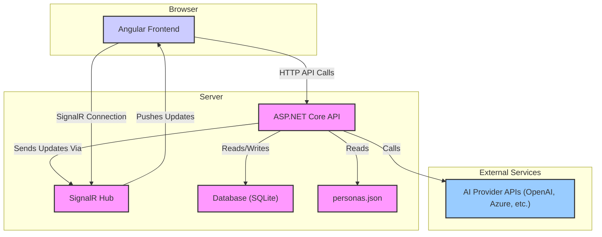
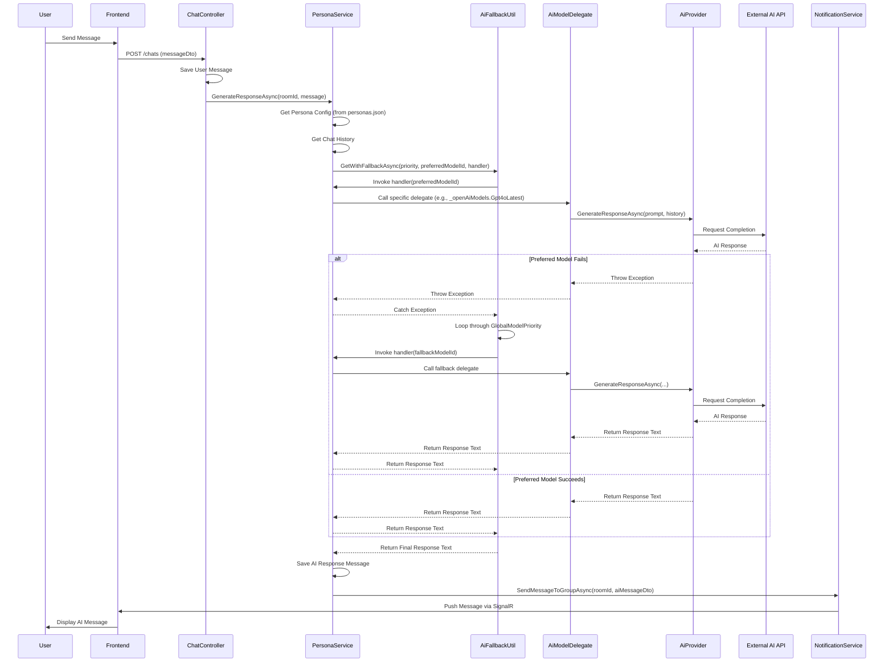

# ChattyMcChatface - AI-Powered Chat Application

Welcome to ChattyMcChatface, a modern real-time chat application featuring AI-powered personas! This
application allows users to chat with each other and interact with different AI personalities.

## Features

-   **Real-time Chat:** Engage in instant messaging with other users using SignalR.
-   **AI Persona Integration:** Chat with AI personas powered by various large language models
    (LLMs). Each persona has a distinct personality defined by a system prompt.
-   **Flexible AI Backend:** Supports multiple AI providers (OpenAI, Azure OpenAI, Gemini, Claude
    via Anthropic/Vertex) with fallback capabilities.
-   **User Authentication:** Secure registration and login.
-   **Modern Tech Stack:** Built with a .NET 9 backend and an Angular frontend.

## Technology Stack

-   **Backend:** .NET 9, ASP.NET Core Web API, SignalR
-   **Frontend:** Angular, TypeScript, RxJS
-   **Database:** Entity Framework Core with SQLite (for development)
-   **AI Integration:** Configurable providers for various LLMs.

## Architecture Overview

The application uses a client-server architecture:

-   **Frontend (Angular):** Single Page Application (SPA) that handles user interaction, displays
    messages, connects to the SignalR hub for real-time updates, and communicates with the backend
    API for data and actions.
-   **Backend API (.NET 9):** Provides RESTful endpoints for user management, chatroom operations,
    and message handling. It orchestrates AI interactions, manages database operations via EF Core,
    and pushes real-time updates via the SignalR Hub.
-   **SignalR Hub:** Facilitates real-time bidirectional communication between the server and
    connected clients.
-   **Database (SQLite):** Stores user accounts, chatroom details, message history, and persona
    associations.
-   **AI Services:** External LLM APIs are called by the backend to generate responses for AI
    personas.



## Project Structure

-   **`angular-client/`**: Contains the Angular frontend application.
    -   `src/app/`: Core application modules, components, and services.
    -   `src/environments/`: Environment-specific configurations (API URLs).
-   **`dotnet_server/`**: Contains the .NET 9 backend API.
    -   `ChattyMcChatface.Api/`: The main ASP.NET Core project (controllers, `Program.cs`, SignalR
        Hub, `personas.json`).
    -   `ChattyMcChatface.Core/`: Business logic, services (including `PersonaService` and AI
        providers), DTOs.
    -   `ChattyMcChatface.Data/`: Entity Framework Core context, entities, and migrations.
    -   `ChattyMcChatface.Tests.Unit/`: Unit tests.
    -   `ChattyMcChatface.Tests.Integration/`: Integration tests.

## Getting Started

**Prerequisites:**

-   [.NET 9 SDK](https://dotnet.microsoft.com/download/dotnet/9.0)
-   [Node.js](https://nodejs.org/) (v18+ recommended) and npm
-   [Git](https://git-scm.com/)

**Setup & Running:**

1.  **Clone the repository:**

    ```bash
    git clone <repository_url>
    cd chatty-mcchatface
    ```

2.  **Install Frontend Dependencies:**

    ```bash
    cd angular-client
    npm install
    cd ..
    ```

3.  **Configure Backend Secrets:** The backend requires API keys for the AI providers. Use the .NET
    Secret Manager:

    ```bash
    cd dotnet_server/ChattyMcChatface.Api
    dotnet user-secrets init # Only needed once per project

    # Example: Set OpenAI Key
    dotnet user-secrets set "OpenAI:ApiKey" "YOUR_OPENAI_API_KEY"

    # Example: Set Azure OpenAI Keys (using 'Thrivify' deployment name from config)
    dotnet user-secrets set "AzureOpenAI:Thrivify:ApiKey" "YOUR_AZURE_API_KEY"
    dotnet user-secrets set "AzureOpenAI:Thrivify:Endpoint" "YOUR_AZURE_ENDPOINT"

    # Example: Set Anthropic Key
    dotnet user-secrets set "Anthropic:ApiKey" "YOUR_ANTHROPIC_API_KEY"

    # Example: Set Gemini Key
    dotnet user-secrets set "Gemini:ApiKey" "YOUR_GEMINI_API_KEY"

    # Example: Set Vertex AI Key (Requires JSON content and Location)
    dotnet user-secrets set "VertexAI:Location" "YOUR_VERTEX_LOCATION" # e.g., us-central1
    # Use single quotes if your shell needs it for the JSON string
    dotnet user-secrets set 'VertexAI:KeyJsonContent' '{"type": "service_account", ...}'

    cd ../..
    ```

    _Refer to `dotnet_server/ChattyMcChatface.Api/secrets.example.json` for the full structure._

4.  **Apply Database Migrations (Optional - Seeded DB included):** The repository includes a
    pre-populated SQLite database (`chatty.db`). If you need to re-apply migrations:

    ```bash
    cd dotnet_server/ChattyMcChatface.Api
    dotnet ef database update
    cd ../..
    ```

    _(Requires EF Core tools: `dotnet tool install --global dotnet-ef`)_

5.  **Run the Application:** From the **root** project directory (`chatty-mcchatface`), run:

    ```bash
    npm run dev
    ```

    This command concurrently starts:

    -   The .NET backend API (listening on `http://localhost:5124` and `https://localhost:7045`).
    -   The Angular frontend development server.

6.  **Access the App:** Open your browser to `http://localhost:4200`. Register a new user or log in.

## Configuration

### AI Provider API Keys

Sensitive API keys for external AI services (OpenAI, Azure, etc.) are managed using the **.NET
Secret Manager** during local development. See the "Configure Backend Secrets" step in the Getting
Started section.

For production deployments, these keys should be configured using environment variables or Azure App
Configuration / Key Vault.

### AI Personas (`personas.json`)

AI personas are defined in `dotnet_server/ChattyMcChatface.Api/personas.json`. Each persona object
includes:

-   `personaUserId`: The ID of the corresponding `User` in the database (must have
    `IsPersona=true`).
-   `displayName`: The name shown in the UI.
-   `systemPrompt`: Instructions defining the AI's personality and behavior.
-   `preferredModelId`: The identifier (from `AiModels.cs`) for the primary AI model this persona
    should use.

**Note:** The current frontend UI (`chat-create.component`) does not yet allow selecting a specific
persona when creating a chatroom. This feature requires further development. Chatrooms must
currently be associated with personas directly via the database or potentially through future API
extensions.

## AI Persona System Flow

When a user sends a message in a chatroom associated with an AI persona:

1.  The message is saved, and the `PersonaService` is triggered.
2.  The service retrieves the persona's configuration (`systemPrompt`, `preferredModelId`) from
    `personas.json` via `IPersonaConfigService`.
3.  Recent chat history is fetched to provide context.
4.  The `AiFallbackUtil` attempts to generate a response using the `preferredModelId`.
5.  A handler function within `PersonaService` maps the `modelId` to the correct AI provider
    delegate (e.g., `_openAiModels.Gpt4oLatest(...)`).
6.  The delegate calls the specific AI provider's implementation (e.g.,
    `OpenAiProvider.GenerateResponseAsync`).
7.  If the preferred model fails, `AiFallbackUtil` tries models from a global priority list
    (`AiFallbackUtil.GlobalModelPriority`).
8.  The successful AI response is saved as a new `ChatMessage` linked to the persona's user ID.
9.  The response is broadcast to all clients in the chatroom via SignalR (`INotificationService`).


