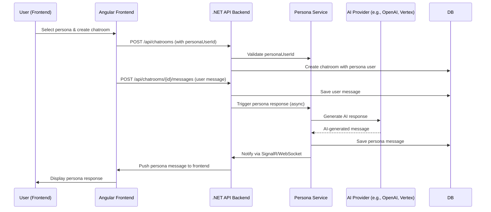

# AI Persona Integration Plan - Overview

## Overall Goal

Integrate AI personas into ChattyMcChatface to enable chatrooms to include an AI participant with a
configurable persona. This persona will automatically respond to user messages, simulating a
conversational partner with distinct characteristics. The system will support multiple personas
selectable during chatroom creation, with seamless integration into the existing backend and
frontend.

---

## High-Level Architecture

---

## Summary of Key Changes

### Backend (.NET)

-   **Persona Definitions:** Add a third persona in `personas.json`.
-   **API Endpoint:** New `GET /api/personas` to list available personas.
-   **DTO Updates:** Extend `CreateChatroomDto` and `ChatroomDetailDto` to include persona info.
-   **Chatroom Creation:** Accept persona selection, validate, and add persona user to chatroom.
-   **Message Handling:** After user message, trigger persona response generation asynchronously.
-   **Persona Service:** Generate AI response, update read status, save message.
-   **Cleanup:** Remove obsolete persona endpoints.

### Frontend (Angular)

-   **Fetch Personas:** Call new API to get persona list.
-   **Chat Creation UI:** Display persona options (dropdown), allow "No Persona".
-   **Chatroom DTOs:** Include persona info in create and detail DTOs.
-   **Chatroom UI:** Show persona info, visually differentiate persona messages.
-   **Cleanup:** Remove unused persona-related methods.

---

This overview guides the detailed backend and frontend implementation plans.
