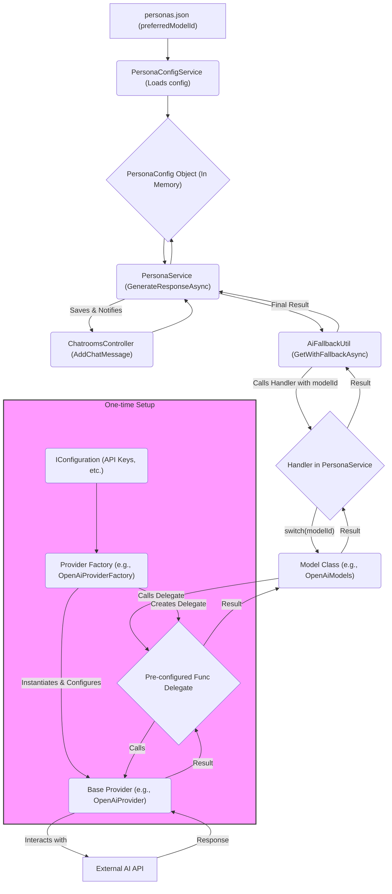

# Persona Preferred Model ID Mapping

This document explains the flow of how a `preferredModelId` specified in the `personas.json`
configuration file is mapped through the backend codebase to eventually invoke the correct AI
provider for generating a response.

## 1. Configuration (`personas.json`)

-   **File:** `dotnet_server/ChattyMcChatface.Api/personas.json`
-   **Role:** Defines the available AI personas. Each persona object includes a `preferredModelId`
    string. This string acts as the initial identifier for the desired AI model.

    **Important:** The value of `preferredModelId` **must** exactly match one of the
    `public const string` values defined in
    `dotnet_server/ChattyMcChatface.Core/Services/AI/AiModels.cs`.

-   **Example:**
    ```json
    {
        "personaUserId": 1001,
        "displayName": "Helpful Assistant",
        "systemPrompt": "...",
        "preferredModelId": "gpt-4o-latest"
    }
    ```

## 2. Loading Configuration (`PersonaConfigService`)

-   **File:** `dotnet_server/ChattyMcChatface.Core/Services/PersonaConfigService.cs`
-   **Action:** At application startup, this service reads `personas.json`. It deserializes the JSON
    array into a list of `PersonaConfig` objects
    (`dotnet_server/ChattyMcChatface.Core/Dtos/PersonaConfig.cs`). These objects, including the
    `preferredModelId` string, are stored in an in-memory dictionary, keyed by `personaUserId`.

## 3. Triggering Response (`ChatroomsController`)

-   **File:** `dotnet_server/ChattyMcChatface.Api/Controllers/ChatroomsController.cs`
-   **Method:** `AddChatMessage`
-   **Action:** When a user sends a message to a chatroom that has a `PersonaUserId` assigned, this
    controller method, after saving the user's message, calls
    `_personaService.GenerateResponseAsync(chatroom.Id, savedChatMessageDto)`.

## 4. Orchestration (`PersonaService`)

-   **File:** `dotnet_server/ChattyMcChatface.Core/Services/PersonaService.cs`
-   **Method:** `GenerateResponseAsync`
-   **Actions:**
    1.  Retrieves the full `PersonaConfig` object for the chatroom using
        `_personaConfigService.GetConfig(chatroom.PersonaUserId.Value)`.
    2.  Calls the static utility method `AiFallbackUtil.GetWithFallbackAsync`.
    3.  Passes key arguments to `GetWithFallbackAsync`:
        -   `AiFallbackUtil.GlobalModelPriority`: A predefined `List<string>` of model IDs to try if
            the preferred one fails.
        -   `config.PreferredModelId`: The specific model ID string read from the persona's
            configuration.
        -   A handler function (defined as a lambda expression within `GenerateResponseAsync`) that
            takes a `modelId` string and returns the `Task<string?>` representing the AI call.

## 5. Fallback Logic (`AiFallbackUtil`)

-   **File:** `dotnet_server/ChattyMcChatface.Core/Services/AI/AiFallbackUtil.cs`
-   **Method:** `GetWithFallbackAsync`
-   **Actions:**
    1.  Attempts to execute the request using the `preferredModelId` by invoking the handler
        function passed from `PersonaService`.
    2.  If the handler function throws an exception (indicating failure for that model), it catches
        the exception.
    3.  It then iterates through the `GlobalModelPriority` list. For each `modelId` in the list, it
        invokes the handler function again.
    4.  It returns the result from the first successful handler invocation (either the preferred
        model or one from the fallback list).
    5.  If all attempts (preferred + fallbacks) fail, it throws an aggregate exception.

## 6. Model ID Mapping (Handler in `PersonaService`)

-   **File:** `dotnet_server/ChattyMcChatface.Core/Services/PersonaService.cs` (Handler lambda
    within `GenerateResponseAsync`)
-   **Action:** This is the crucial mapping step. The handler function receives a `modelId` string
    (either the preferred one or one from the fallback list).
-   **Action:** It uses a `switch` statement based on this `modelId` string.

    **Action:** The `switch` statement requires an **exact match** between the incoming `modelId`
    string and one of the `public const string` values defined in
    `dotnet_server/ChattyMcChatface.Core/Services/AI/AiModels.cs`. If a desired model identifier
    (e.g., a generic "gpt-4") is not present as a constant in `AiModels.cs`, it must be added there
    and mapped within the `switch` statement before it can be used in `personas.json`.

-   **Action:** The `case` labels within the `switch` statement use **string constants** defined in
    `dotnet_server/ChattyMcChatface.Core/Services/AI/AiModels.cs` (e.g.,
    `case AiModels.OpenAiGpt4oLatest:`). This maps the raw string ID to a known, strongly-typed
    constant within the codebase.
-   **Action:** Each `case` block calls a specific, pre-configured delegate stored within one of the
    injected **Model Classes** (e.g.,
    `return await _openAiModels.Gpt4oLatest(config.SystemPrompt, historyDtoList) ?? string.Empty;`).

## 7. Model Class Delegates (e.g., `OpenAiModels`)

-   **Files:** e.g., `dotnet_server/ChattyMcChatface.Core/Services/AI/OpenAI/OpenAiModels.cs`,
    `.../Vertex/VertexAiModels.cs`, etc.
-   **Role:** These classes are registered as singletons via Dependency Injection
    (`dotnet_server/ChattyMcChatface.Api/Program.cs`).
-   **Action:** Their constructors run once at application startup. Inside the constructor, they use
    a corresponding **Provider Factory** (see next step) to create and store
    `Func<string, List<ChatMessageDto>, Task<string?>>` delegates. Each delegate corresponds to a
    specific model variant supported by that provider (e.g., a `Gpt4oLatest` property holds the
    delegate for that specific OpenAI model).
-   **Example Property:**
    `public Func<string, List<ChatMessageDto>, Task<string?>> Gpt4oLatest { get; private set; }`

## 8. Provider Factories (e.g., `OpenAiProviderFactory`)

-   **Files:** e.g.,
    `dotnet_server/ChattyMcChatface.Core/Services/AI/OpenAI/OpenAiProviderFactory.cs`,
    `.../Vertex/VertexAiProviderFactory.cs`, etc.
-   **Role:** These are typically static classes with methods like
    `CreateOpenAiGpt4oLatestDelegate`.
-   **Actions:**
    1.  Instantiate the actual **Base Provider** class (see next step) (e.g.,
        `new OpenAiProvider(...)`).
    2.  Inject necessary dependencies like `IConfiguration`, `ILogger`, `IHttpClientFactory` into
        the Base Provider's constructor. This allows the provider to access API keys, endpoints, and
        other settings from configuration.
    3.  Return the `Func<string, List<ChatMessageDto>, Task<string?>>` delegate. This delegate is
        usually a lambda expression that captures the configured provider instance and calls its
        `GenerateResponseAsync` method, passing along the system prompt and message history.

## 9. Base Providers (e.g., `OpenAiProvider`)

-   **Files:** e.g., `dotnet_server/ChattyMcChatface.Core/Services/AI/OpenAiProvider.cs`,
    `.../VertexAiProvider.cs`, etc.
-   **Role:** These classes implement the `IAiProvider` interface.
-   **Action:** They contain the core logic for interacting with a specific AI service's API. This
    might involve using an official SDK (like for OpenAI, Azure, Gemini) or making direct HTTP calls
    (like for Claude via Vertex AI in this project).
-   **Method:** The `GenerateResponseAsync(string systemPrompt, List<ChatMessageDto> history)`
    method takes the prompt and history, formats the request according to the specific AI API's
    requirements, executes the API call, parses the response, and returns the generated text string.

## 10. Summary Diagram



This detailed flow shows how the system maps a configuration string to a specific, configured AI
provider call, incorporating dependency injection, factories, and fallback logic.
