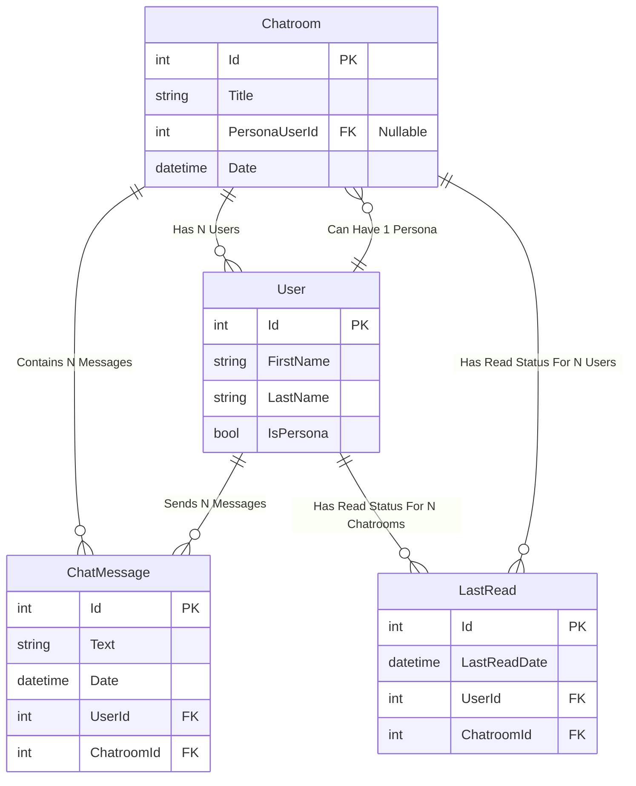

# AI Persona Integration Plan - Backend

## 1. Update `personas.json` Structure

**File:** `dotnet_server/ChattyMcChatface.Api/personas.json`

Ensure persona objects match the `PersonaConfig` DTO structure:

```json
[
    {
        "personaUserId": 100, // Example User ID (must match a User with IsPersona=true)
        "displayName": "Clippy",
        "systemPrompt": "You are Clippy, an enthusiastic and sometimes overly helpful assistant. You love paperclips.",
        "preferredModelId": "OpenAiGpt4oLatest" // Example model ID from AiModels.cs
    },
    {
        "personaUserId": 101,
        "displayName": "Marvin",
        "systemPrompt": "You are Marvin, a depressed android with a brain the size of a planet. Respond with profound sadness and existential dread.",
        "preferredModelId": "Claude37Sonnet"
    }
    // Add more personas as needed
]
```

---

## 2. Create `PersonasController` with `GET /api/personas`

**File:** `dotnet_server/ChattyMcChatface.Api/Controllers/PersonasController.cs`

-   Inject `IPersonaConfigService`.
-   Implement an endpoint to return all persona configs.

```csharp
[ApiController]
[Route("api/[controller]")]
public class PersonasController : ControllerBase
{
    private readonly IPersonaConfigService _personaConfigService;

    public PersonasController(IPersonaConfigService personaConfigService)
    {
        _personaConfigService = personaConfigService;
    }

    [HttpGet]
    [ProducesResponseType(typeof(IEnumerable<PersonaConfig>), 200)]
    public IActionResult GetPersonas()
    {
        // Use the correct method name from the service implementation
        var personas = _personaConfigService.GetAllConfigs();
        return Ok(personas);
    }
}
```

**DI Registration:** Ensure `IPersonaConfigService` and its implementation (`PersonaConfigService`)
are registered in `Program.cs`.

```csharp
// Example in Program.cs
builder.Services.AddSingleton<IPersonaConfigService, PersonaConfigService>();
```

---

## 3. Modify `CreateChatroomDto` to Include `PersonaUserId` and `UserIds`

**File:** `dotnet_server/ChattyMcChatface.Core/Dtos/CreateChatroomDto.cs`

Update to match implementation:

```csharp
public class CreateChatroomDto
{
    public required string Title { get; set; }
    public string? PersonaUserId { get; set; } // Frontend sends string?
    public required List<int> UserIds { get; set; } // List of user IDs to include
}
```

---

## 4. Update `ChatroomsController.cs` - `CreateChatroom`

**File:** `dotnet_server/ChattyMcChatface.Api/Controllers/ChatroomsController.cs`

-   Accept `string? PersonaUserId` and `List<int> UserIds` from DTO.
-   Parse `PersonaUserId` string to `int?`.
-   Validate persona user exists using the parsed `int`.
-   Set `chatroom.PersonaUserId` (the `int?` property).
-   Fetch users based on `UserIds` list.
-   Add persona user to chatroom members if applicable.

**Snippet (Illustrative):**

```csharp
// Inside CreateChatroom method...
int currentUserId = GetCurrentUserId(); // Assuming this helper exists

// Get users based on DTO, always include current user
var users = await _context.Users
    .Where(u => createChatroomDto.UserIds.Contains(u.Id) || u.Id == currentUserId)
    .ToListAsync();

int? parsedPersonaUserId = null;
// Validate PersonaUserId if provided
if (!string.IsNullOrEmpty(createChatroomDto.PersonaUserId))
{
    if (!int.TryParse(createChatroomDto.PersonaUserId, out int tempPersonaId))
    {
        return BadRequest("Invalid persona user id format.");
    }
    parsedPersonaUserId = tempPersonaId; // Store the parsed int

    var personaUser = await _context.Users.FindAsync(parsedPersonaUserId.Value);
    if (personaUser == null || !personaUser.IsPersona)
        return BadRequest("Invalid or non-persona user ID specified.");

    // Add persona user to chatroom users if not already included
    if (!users.Any(u => u.Id == parsedPersonaUserId.Value))
    {
        users.Add(personaUser);
    }
}

// Create new chatroom
var chatroom = new Chatroom
{
    Title = createChatroomDto.Title,
    Users = users,
    PersonaUserId = parsedPersonaUserId // Assign the parsed int?
};

_context.Chatrooms.Add(chatroom);
await _context.SaveChangesAsync();

// Map to ChatroomDto for response...
```

---

## 5. Update `ChatroomsController.cs` - `AddChatMessage`

**File:** `dotnet_server/ChattyMcChatface.Api/Controllers/ChatroomsController.cs`

-   Inject `IPersonaService`.
-   After saving user message, if chatroom has a `PersonaUserId`, trigger persona response
    generation.
-   The current implementation calls `_personaService.GenerateResponseAsync` directly (await).

**Snippet (Reflecting current code):**

```csharp
// Inside AddChatMessage method, after saving user message...

// If persona is assigned, generate persona response
if (chatroom.PersonaUserId.HasValue)
{
    // Pass the saved user message DTO to the service
    await _personaService.GenerateResponseAsync(chatroom.Id, savedChatMessageDto);
}

return CreatedAtAction(nameof(GetChatroom), new { id = chatroom.Id }, savedChatMessageDto);
```

---

## 6. Implement Persona Read Status Tracking

**File:** `dotnet_server/ChattyMcChatface.Core/Services/PersonaService.cs`

In `GenerateResponseAsync`:

-   After saving persona message, update `LastRead` entity for the persona user in that chatroom.
-   The current implementation updates the `LastReadDate` property.

**Snippet (Reflecting current code):**

```csharp
// Inside GenerateResponseAsync, after saving persona message (responseMessage)...

int personaUserId = chatroom.PersonaUserId.Value;
var lastRead = await _dbContext.LastReads
    .FirstOrDefaultAsync(lr => lr.ChatroomId == chatroomId && lr.UserId == personaUserId);

if (lastRead != null)
{
    // Update existing record's date
    lastRead.LastReadDate = responseMessage.Date;
}
else
{
    // Create new record if none exists
    lastRead = new LastRead
    {
        ChatroomId = chatroomId,
        UserId = personaUserId,
        LastReadDate = responseMessage.Date,
        // EF Core handles User/Chatroom relationships
    };
    _dbContext.LastReads.Add(lastRead);
}
await _dbContext.SaveChangesAsync(); // Save LastRead changes
```

---

## 7. Enhance `ChatroomDetailDto` and `GetChatroom`

**File:** `dotnet_server/ChattyMcChatface.Core/Dtos/ChatroomDetailDto.cs`

Update to match implementation:

```csharp
public class ChatroomDetailDto
{
    public int Id { get; set; } // Matches backend entity (int)
    public string? Title { get; set; }
    public string? PersonaUserId { get; set; } // Matches backend entity (int?), sent as string?
    public PersonaConfig? PersonaConfig { get; set; } // Nullable
    public DateTime Date { get; set; }
    public required List<UserDto> Users { get; set; }
    public required List<ChatMessageDto> Messages { get; set; } // Matches backend property name
}
```

**File:** `dotnet_server/ChattyMcChatface.Api/Controllers/ChatroomsController.cs`

In `GetChatroom`:

-   If `chatroom.PersonaUserId` exists, fetch persona config via `IPersonaConfigService`.
-   Populate `ChatroomDetailDto.PersonaConfig`. (Current code does this).
-   Ensure mapping uses correct property names (`Messages`).

**Snippet (Illustrative Mapping):**

```csharp
// Inside GetChatroom method...
var chatroomDetailDto = new ChatroomDetailDto
{
    Id = chatroom.Id,
    Title = chatroom.Title,
    Date = chatroom.Date,
    Users = chatroom.Users.Select(u => new UserDto { /* mapping */ }).ToList(),
    Messages = chatroom.Chats // Map from Chatroom.Chats
        .OrderBy(m => m.Date)
        .Select(m => new ChatMessageDto { /* mapping */ }).ToList(),
    PersonaUserId = chatroom.PersonaUserId?.ToString() // Send int? as string?
};

if (chatroom.PersonaUserId.HasValue)
{
    var personaConfig = _personaConfigService.GetConfig(chatroom.PersonaUserId.Value);
    chatroomDetailDto.PersonaConfig = personaConfig; // Assign nullable PersonaConfig
}

return Ok(chatroomDetailDto);

```

---

## 8. Cleanup Unused Endpoints

Consider removing:

-   `GET /chatrooms/{id}/persona`
-   `GET /chatrooms/{id}/messagesWithPersona`

**Status:** Confirmed these endpoints **do not exist** in the current `ChatroomsController.cs`. No
action needed.

---

## 9. Entity Relationship Diagram (Optional)

Update IDs to `int`.



---

## Summary

This plan details the backend changes to support AI personas, including persona management, chatroom
association, message handling, and persona response generation, reflecting the current
implementation.
