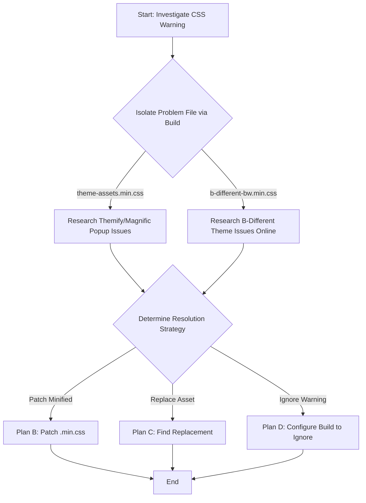

# CSS Warning Investigation Plan (`0% -> Unmatched selector: %`)

This plan outlines the steps to investigate and resolve the CSS warning
`1 rules skipped due to selector errors: 0% -> Unmatched selector: %` occurring during the Angular
build (`ng build`), originating from `angular-client/src/assets/css/theme-assets.min.css` or
`angular-client/src/assets/css/b-different-bw.min.css`.

**Context:**

-   The warning occurs during the `ng build` process.
-   The suspected files are third-party minified CSS: `theme-assets.min.css` (Themify Icons,
    Magnific Popup) and `b-different-bw.min.css` (B-DIFFERENT theme).
-   Initial searches for a literal `%` selector in the minified files were inconclusive.
-   The original, non-minified source for `b-different-bw.min.css` is not readily available.

**Investigation Plan:**

1.  **Isolate the Problem File:**

    -   Temporarily comment out `theme-assets.min.css` in `angular-client/angular.json`'s `styles`
        array.
    -   Run `ng build` and check if the warning persists.
    -   Restore the line.
    -   Temporarily comment out `b-different-bw.min.css` in `angular-client/angular.json`'s `styles`
        array.
    -   Run `ng build` and check if the warning persists.
    -   Restore the line.
    -   This will identify which file (or interaction) causes the warning.

2.  **Targeted Investigation (Based on Step 1):**

    -   **If `theme-assets.min.css` is the cause:** Research known issues combining Themify
        Icons/Magnific Popup with Angular builds and this specific CSS warning online.
    -   **If `b-different-bw.min.css` is the cause:**
        -   Research known issues related to the "B-DIFFERENT" theme and the CSS warning in Angular
            online.
        -   Consider using a CSS formatter/beautifier on the minified file to aid manual inspection
            if online research yields no results (less reliable).

3.  **Determine Resolution Strategy:** Based on the findings, choose the best path:
    -   **(B) Patch Minified File:** If the problematic rule can be pinpointed in the `.min.css`
        file _and_ confirmed safe to remove/modify without breaking styles, apply a direct patch.
        (Use cautiously)
    -   **(C) Replace Asset:** If the theme/library is old, unsupported, or the fix is too
        complex/risky, consider finding and integrating a modern replacement.
    -   **(D) Ignore Warning:** If research confirms the warning is benign for target
        browsers/environment (e.g., a known build tool bug), configure the Angular build
        (`angular.json` build options) to suppress this specific warning.

**Investigation Flow:**

